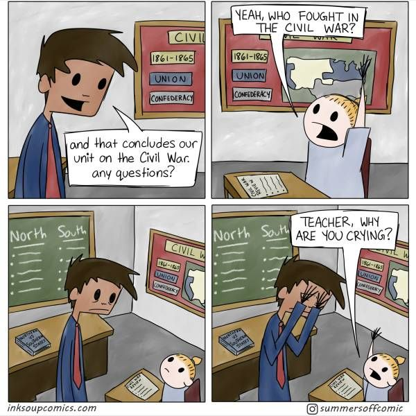

## Why Coding Standards?

### The looks of coding
Would you believe me if I said that coding standards saves my life everyday. Well not literally, but it feels like it does. Coding standards serve many purposes. One of which is displayed in the blocks of code above. On the left is the code without any coding standard being used. On the right is the same code with coding standards being implemented. Just from a first glance, it is obvious that the code with the coding standard is much easier to read as compared to the same code without the standards.

### Commenting

Coding standards serve for more than just the ‘aesthetics’ of a program. These standards can also aid in helping people understand your code. This can be done through commenting which explains what a block of code does. In my previous classes, my professors would heavily stress on commenting on the code you write. Often, the comments would take just as long as writing the code itself. Commenting seems really cumbersome but its benefits shine when you start to share code. Especially when you are searching for the code for a problem online, commenting will help you actually comprehend how and why the code works.
Take the snippet of code above. On the left, there is commenting on some code. It identifies what the code is doing and explains the properties of the object. For anyone who has had some experience with coding, understanding this code is not difficult. However, for beginners having these comments are really helpful in understanding what the code is doing. If my professors did not properly comment on the example programs they wrote, I probably would have struggled a lot more with the assignments than I already was.

## How coding standards save my life

The actual life-saving comes when you use the coding standards and implement them using a standard checker tool. Recently, I have been using ESLint as a coding standard compliance checker and I am liking it so far. These tools will sometimes send hints that are like blessings from heaven. It happens all too often where hours are spent on a program only for it to not compile.  Anyone who is a computer science major or has worked with coding before can relate when I say that even the smallest mistake or typo will ruin the entire functionality of your program. For instance:

```cpp
const arr = [];

function projectEulerOne() { 
  let sum = 0;
  for (let i = 0; i < 1000; i++) {
    if (i % 3 == 0 || i % 5 == 0) {
      arr.push(i);
    }
  }
  for (let j = 0; j < arr.length; j++ ) {
    sum += arr[j];
  }
  return sun;
}
console.log(projectEulerOne());
```

This block of code won’t compile just because of a small typo in the variable ‘sum’. For most, they struggle to find these small mistakes. Now imagine having to find these same mistakes in thousands of lines of code. It will feel almost impossible to do or take hours out of your day that you could have spent on more important things. Going through a ridiculous amount of code to figure out why my code isn’t working is absolute torture. It is even more dreadful when you realize that it was because of a misspelling. This is where a standard checker comes in handy. It will help in ensuring that you are properly referencing variables and that your syntax is correct. Using a standard checker tool, I am able to save hours of my time that I would have otherwise wasted on trying to find those minute mistakes.

## What I think of Coding Standards

Coding standards are often seen in a very negative, trivial light. Most of this roots from how much of a nuisance and unnecessary that it seems. A lot of people tend to complain about those small details like putting a newline at the end of your code or all of the spaces that you have to put in specific places.I do agree that not all of the aspects of coding standards are life or death for the functionality of your program. However, I do believe that the benefits of those details will come to show as you continue to create longer programs or write more code. The only major problem that I have is with implementing coding standards in a timed situation. Especially for assessments, I worry that I won’t be able to properly correct my code to comply with the coding standards in time.

Although learning and implementing coding standards may be irritating initially, the difficulty dwindles and the extra effort put in really starts to pay off. In the beginning, I didn’t enjoy using coding standards as it took so much time to do. However, now that I have had experience with it and am able to implement the standards much quicker, it has gotten easier. I would say that coding standards actually helps with the accessibility of the code. While I do not exactly enjoy the coding standards, I do understand and appreciate what it does for coding and the coding community.
