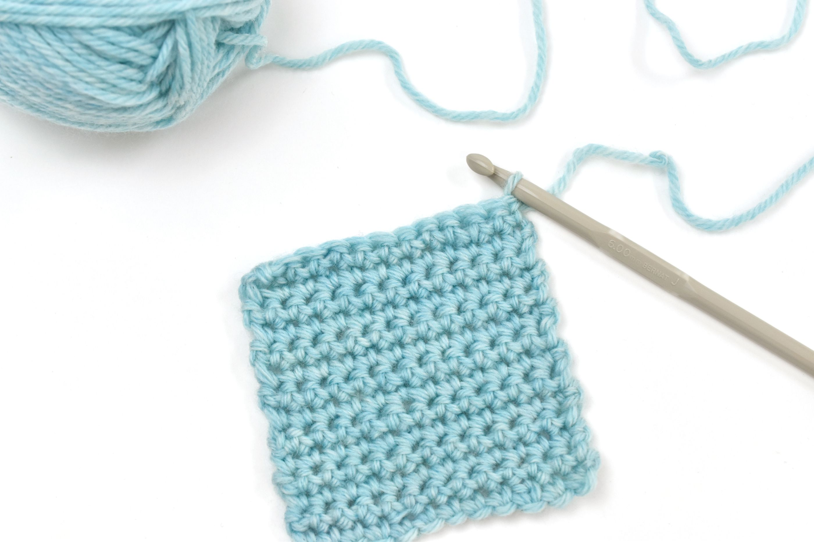
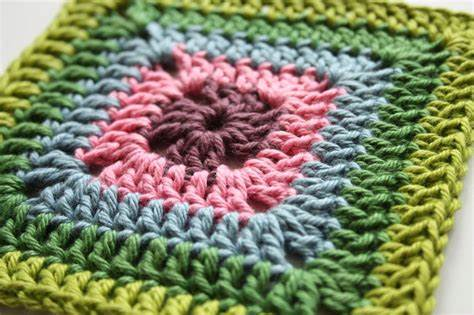

# The similarity of crochet and design patterns
  Outside of coding, I have been trying to explore new extracurriculars. As of recently, a hobby that I have been indulging myself in is learning to crochet. I have slowly begun to learn quite a few stitches that have allowed me to create intricate patterns in my crafts. In terms of coding, there is something similar to the variety of ‘stitches’: design patterns. Design patterns are generally defined structures and trends that describe common solutions to problems found within code. Much like how each plush or craft has a unique sequence and series of stitches, these design patterns serve as a blueprint or template. Using these design patterns can guide developers on how to approach certain problems. From my experience with coding and crocheting, I have found parallels within their designs. Just as crocheting has multiple stitches, coding may also have various design patterns.
  
## Single Crochet Stitch and Singleton

      
  The very first stitch that I learned was a single crochet stitch which served as my building block for my very first crochet project. Learning and implementing this stitch in my project was extremely simple; I was still able to create something purely off of single stitches.
 A design pattern that shares attributes with this stitch is the Singleton pattern. This pattern is known to be relatively easy to implement. In this pattern, only one instance of an object exists, granting the user global access. However, granting global access is not always the wisest thing to do, especially in cases where global access is not required. Both the Singleton and the single stitch serve as a foundation for more complex and intricate patterns. In this way, the Singleton pattern is similar to the single crochet stitch.

## Granny Squares

  
  Just like a granny square, a complete and functional program is often made from a culmination of various design patterns. By combining a multitude of stitches, crocheters are able to create very complicated patterns in a square motif. In a program, many design patterns can be used to address certain issues, therefore, giving a structured way to create a solution.
While I have never tried to make a granny square as of yet, I do understand that the degree of complexity drastically increases as you attempt more intricate patterns.
# Implementation of Design Patterns
  Just as I follow crochet patterns to create various plushies, I also use design patterns throughout my code. A common design pattern that I have been using, at least as of recently, is the observer pattern. Specifically, I have been implementing this design pattern through publications and subscriptions. For instance, a block of code that illustrates this design pattern is:
  
```cpp
 const { _id } = useParams();
  // console.log('EditProfile', _id);
  // useTracker connects Meteor data to React components. https://guide.meteor.com/react.html#using-withTracker
  const { doc, ready } = useTracker(() => {
    // Get access to Profile documents.
    const subscription = Meteor.subscribe(Students.userPublicationName);
    // Determine if the subscription is ready
    const rdy = subscription.ready();
    // Get the document
    const document = Students.collection.findOne(_id);
    return {
      doc: document,
      ready: rdy,
    };
  }, [_id]);
  // console.log('EditProfile', doc, ready);
  // On successful submit, insert the data.
  const submit = (data) => {
    const { name, owner, level, grasshopper, sensei } = data;
    Students.collection.update(_id, { $set: { name, owner, level, grasshopper, sensei } }, (error) => (error ?
      swal('Error', error.message, 'error') :
      swal('Success', 'Item updated successfully', 'success')));
  };
 ```
  
  In this code, I publish and subscribe to the Students collection. The user will only be able to view the documents in the collection that belong to them. In this way, I am able to allow the user to access the profile information that they entered when they registered with the program.
  Another design pattern that I have been using in my code often is the Singleton pattern. Prior to creating the block of code, I first created a Student Collection. This collection would take in the name of the user, their email, grade level, and other academic information. I would then create a single instance of this Collection where I can insert, update, and delete documents.

# Design Patterns
  Much like crochet patterns and stitches, there are various defined design patterns that will ultimately influence the architectural structure of your code. Design patterns are the stitches of crochet that guide those who implement them to create structured solutions. Rather than actual code, design patterns provide structures that give approaches to solving a problem. Developers implementing design patterns streamline the coding process. These design patterns promote reusability and maintainability of code. As a result, other developers can actually understand the structure and functionality of the code that you create.

