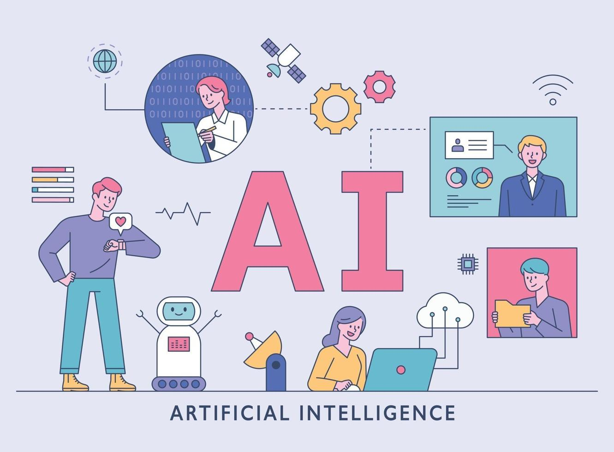

### My Journey To Becoming a SWE:
  

  
More than just the web-development focused technology stack encompassed within the class, I have learned far more skills towards becoming better in my academic and professional career. From learning how to better manage the projects that I work on and who I am working with, to determining whether my actions are ethical in retrospect, these skills are not only applicable within the scope of software engineering but also within various aspects of my life. 

  

### To Be a SWE:
  
 

