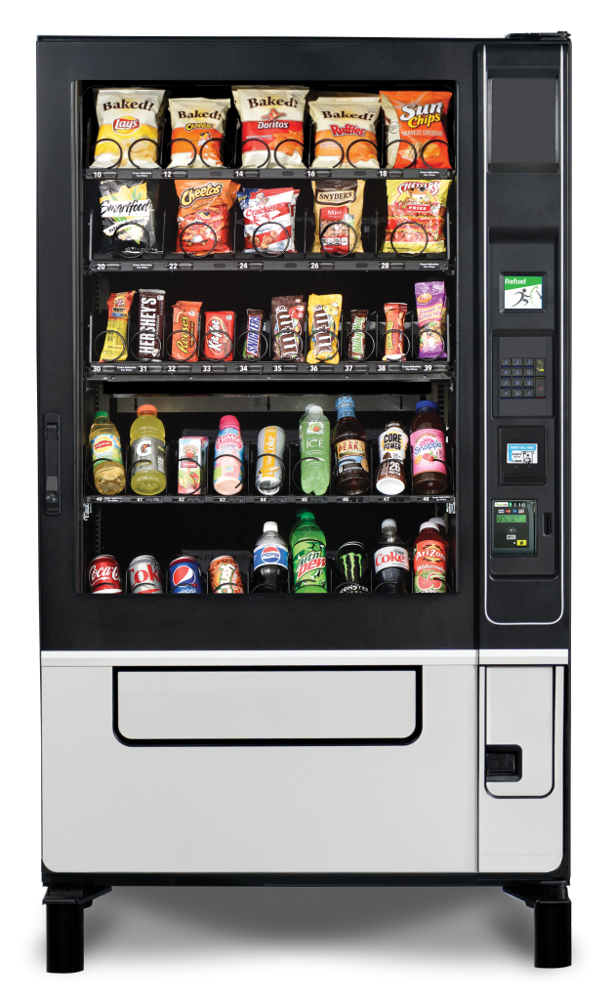

During my fall semester of my second year in my computer science degree, I was assigned to create a binary search tree with nodes that contained snack objects. These snack objects contained the price, calories, barcode, and name of the snack. All of this code would be done using Java. I would define functions in a seperate class to help create the binary search tree. An example of one of the functions is below: 

<pre>
public boolean addNodes(SnackNode root, Snack sn){
      // creates a new node containing a snack
      SnackNode newNode = new SnackNode(sn);
      // In the case that the snack already exists in the BST tree
      if(sn.compareTo(root.getSnack()) == 0){
         return false;
      }
      // In the case that the snack's barcode is greater than the parent's
      else if(sn.compareTo(root.getSnack()) == 1){
         // Once it finds an empty node given the conditions, the new node will take the empty spot
         if (root.getRightChild() == null){
            root.setRightChild(newNode);
            return true;
         }
         // If the next node is not empty, it will continue to search for an empty node using recursion
         else{
            addNodes(root.getRightChild(), sn);
            return true;
         }
      }
      // In the case that the snack's barcode is less that the barcode of the snack in the node
      else if(sn.compareTo(root.getSnack()) == -1){
         // Once an empty node is found, the new node will take the empty spot
         if (root.getLeftChild() == null){
            root.setLeftChild(newNode);
            return true;
         }
         // Recursively searches for an empty node following the conditions
         else{
            addNodes(root.getLeftChild(), sn);
            return true;
         }
      }
      return false;
   
   }

</pre>

I was first responsible with creating the snack objects. Each of the snack object's parameters had to be validated in order for the snack to be created. I would also end up creating a snack exception in the case that an exception is thrown in the snack class. I was also responsible for creating the nodes containing the snacks. Finally, I had to link the nodes together based on the logic of a binary search tree. In this class, I would define how to add nodes and print the tree. Also, I would delete and find the snack nodes based on their barcodes. Finally, these functions would then be called in the driver class.

From this assignment, I learned the basics of a binary search tree and how to apply this concept through code. It was my first time dealing with a binary search tree so there were many trials and tribulations with programming the Snack BST. It was also a project that we were slowly building upon throughout the semester. This project was so significant to me as it would teach me perserverance and determination despite being frustrated. There were many times where my code would not compile or simply not function correctly. In those instances, I would want to give up. However, I decided to push through the frustation. In the end, I was able to create a program that I was satisfied with.
