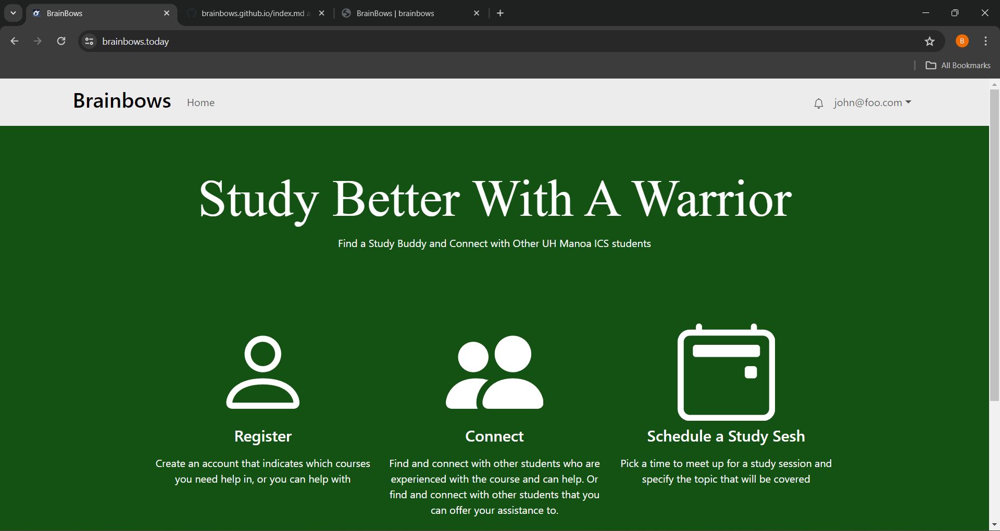
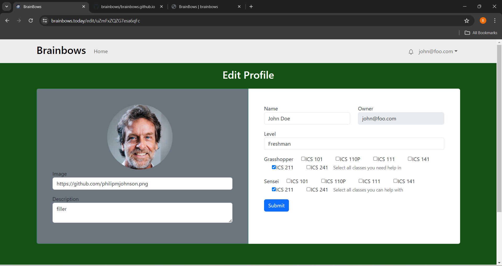
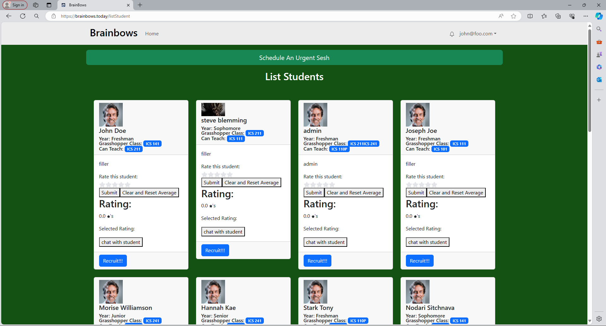

BrainBows is a study buddy app for UH Manoa ICS students that my group mates and I created using Meteor. The main issue that we found within the ICS department, and in academics in general, is that it can be difficult to find friends to study with. Especially since having a study partner is integral to your academic success and experience, making a study buddy app that makes finding mentors and study buddies much easier would be extremely beneficial for ICS students. Using BrainBows, students can find a study buddy based on their academic needs and the classes that they need help in. Users can also serve as mentors or study buddies for classes that they have completed or excel in. BrainBows hopes to encourage camaraderie and the quality of life in the UH Manoa ICS department.

In the project, I was responsible for the main functionalities that are available to the user. I created the landing page which the user will see as soon as they open up BrainBows. The landing page was created using HTML and CSS as well as Bootstrap5 as its framework. It displays the various usages of the BrainBows app.

I then made a page where users are able to update their profile information. In order to receive this information, I included fields that the user will have to fill out as they are creating an account with BrainBows.

I also created the notification and matching systems that the users will employ to create study sessions. Both the notification and matching systems were created using MongoDB as its database. There are two types of sessions that the students can create. The first session is an urgent study session. With this type of study session, all 'senseis' of the class that the student needs help in will be notified. The other session is a regular study session. Students are able to create a study session with a student of their choice that hopefully matches their current needs. Once the session is created, the sensei will be notified that the student has created a study session with them. The notifications will display the student's information such as their name, the class they need help in, and the topic. The notification will also include the time when the study session will occur. To clear out their notifications, the users will be able to delete them. 

Although I was not entirely responsible for it, there are also other features within the BrainBows app that would be of benefit to the users. This includes a goal system where students can keep track of their long and short-term goals. There is also a calendar which keeps track of the study sessions. Finally, there is an office hours page where students are able to view the various office hours of the ICS professors.

I have significantly developed my full-stack development skills. I have learned exponentially how MongoDB works as well as improved my skills of working with JavaScript, HTML/CSS, BootStrap5, and React. Due to how much I was involved with this project, I had a lot of experience with implementing the backends of our systems using MongoDB. At the start, I had a difficult time using MongoDB as it was my first time using it. However, once I learned how it functions, the rest came quite easyily to me. Besides the technological skills that I have developed, the most important lesson I gained is the pivotal experience of working with a group on a major project. Teamwork, communication, group development, and dynamics are skills that I will continue to improve on.

To view the app: <a href="https://brainbows.today/">BrainBows</a>

To view the GitHub repository: <a href="https://brainbows.github.io/">BrainBows Repository</a>

